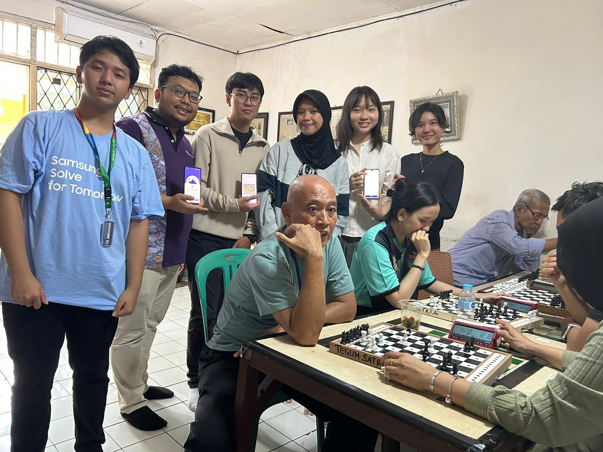
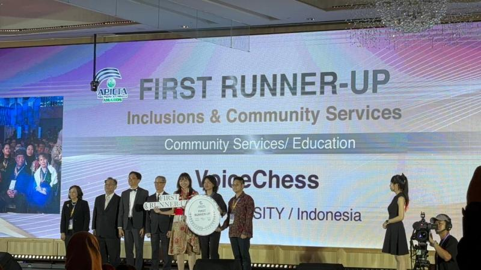

# ♟️ VoiceChess

An accessible chess application designed specifically for visually impaired and blind players.

## 🎯 About Us

We're a team dedicated to making chess accessible to everyone. Our mission is to break down barriers and create an inclusive chess experience through:

- 🔊 Audio-first design
- 👆 Tactile feedback support
- ♿ Full screen reader compatibility
- 🌍 Accessible for players of all visual abilities

## 🏆 Achievements

NOGA has been recognized at both national and international levels for its innovation in AI-powered nutrition analysis:

- 🥈 **2nd Best Finalist** — Samsung Solve for Tomorrow (Tangerang, National)
- 🌏 **First Runner-Up** — APICTA Awards 2025 (Taiwan, International)

### 📸 Highlights

  
  

## 🔥 Key Features

- **Voice Navigation** - Complete voice-guided interface
- **Audio Announcements** - Clear spoken move notifications and board state
- **Screen Reader Support** - Fully compatible with JAWS, NVDA, VoiceOver, TalkBack
- **Tactile Board Integration** - Support for physical braille chess boards
- **Keyboard Navigation** - Full keyboard control without mouse
- **Customizable Audio Cues** - Personalize sound feedback
- **Descriptive Notation** - Algebraic notation with audio output
- **AI Training Mode** - Practice with different difficulty levels
- **Online Multiplayer** - Play against other visually impaired players worldwide

## ♿ Accessibility Standards

Our application complies with:

- WCAG 2.1 Level AAA
- Section 508 Standards
- EN 301 549 (European Accessibility Standard)

♿♟️ **Making chess accessible for everyone, one move at a time** ♟️♿
